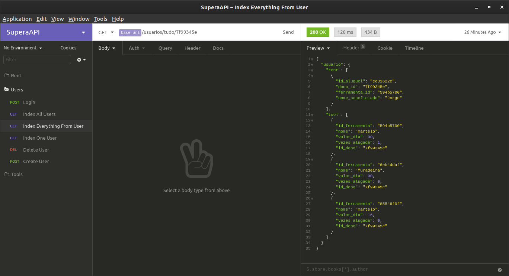

# Supera's API
> API required by the Supera Tecnologia team for the second stage of the internship selection process.


REST API for requests, routes and business rules.



## Installation

Clone the repository;
Run the DataBase Script to create MySQL Database:


Open the API Code and change the "knex.js" file to connect into your new database:

```sh
development: {
    client: 'mysql',
    connection: {
      host : 'your-host',
      user : 'your-user',
      password : 'your-password',
      database : 'supera'
    },
    useNullAsDefault: true,
  },
```

Install the dependencies:

```sh
npm install
```

## Usage example

You can import the "Insomnia_SuperaAPI.json" file into Insomnia to test the API with some requisitions.


## Development setup

Describe how to install all development dependencies and how to run an automated test-suite of some kind. Potentially do this for multiple platforms.

```sh
make install
npm test
```


